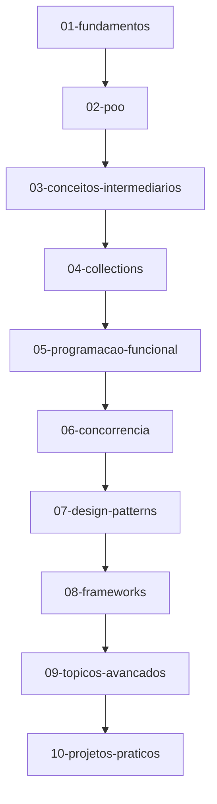

# 🚀 Java Studies - Jornada de Aprendizado

Este repositório documenta minha jornada de aprendizado em Java, desde conceitos fundamentais até tópicos avançados. O objetivo é desenvolver um domínio sólido na linguagem através de estudo estruturado e prática consistente.

## 📋 Índice

- [Estrutura do Repositório](#estrutura-do-repositório)
- [Roadmap de Estudos](#roadmap-de-estudos)
- [Estratégia de Versionamento](#estratégia-de-versionamento)
- [Como Navegar no Repositório](#como-navegar-no-repositório)
- [Progresso Atual](#progresso-atual)
- [Recursos Utilizados](#recursos-utilizados)

## 🗂️ Estrutura do Repositório

O repositório está organizado em 10 módulos progressivos:

### **Fase 1: Fundação**
- **01-fundamentos** - Sintaxe básica, tipos primitivos, operadores
- **02-poo** - Programação Orientada a Objetos
- **03-conceitos-intermediarios** - Strings, Collections básico, Exceptions

### **Fase 2: Intermediário**
- **04-collections** - Framework Collections, estruturas de dados
- **05-programacao-funcional** - Lambda, Streams, Optional
- **06-concorrencia** - Threads, Synchronization, Paralelismo

### **Fase 3: Avançado**
- **07-design-patterns** - Padrões de Design (GoF)
- **08-frameworks** - Spring, Hibernate, Testing
- **09-topicos-avancados** - JVM, Performance, Security

### **Fase 4: Especialização**
- **10-projetos-praticos** - Aplicações reais e portfólio

## 🛣️ Roadmap de Estudos



**Critério de Progressão:** Cada módulo é considerado completo quando consigo:
- ✅ Explicar os conceitos sem consultar material
- ✅ Implementar exemplos práticos do zero  
- ✅ Resolver exercícios de diferentes complexidades
- ✅ Aplicar o conhecimento em um mini-projeto

## 🔄 Estratégia de Versionamento

### **Commits Semânticos**

Este projeto utiliza a convenção de commits semânticos para manter um histórico claro e organizado:

| Tipo | Descrição | Exemplo |
|------|-----------|---------|
| `feat:` | Novos conceitos aprendidos | `feat: implementa conceitos de herança` |
| `docs:` | Documentação e README | `docs: adiciona resumo sobre polimorfismo` |
| `refactor:` | Melhoria de código existente | `refactor: otimiza implementação de ArrayList` |
| `fix:` | Correções de bugs/erros | `fix: corrige lógica do método ordenação` |
| `study:` | Exercícios e anotações | `study: resolve exercícios de streams` |

### **Estratégia de Branches**

```
| Branch | Propósito | Exemplo |
|--------|-----------|---------|
| `main` | Código estável e bem documentado | Branch principal |
| `feature/topico` | Estudar novos assuntos | `feature/spring-boot-basics` |
| `exercise/nome` | Resolver exercícios específicos | `exercise/design-patterns-builder` |

## 🧭 Como Navegar no Repositório

1. **Iniciantes**: Comece pelo `01-fundamentos` e siga a sequência numérica
2. **Tópico específico**: Use a busca ou navegue direto para a pasta do módulo
3. **Projetos práticos**: Vá direto para `10-projetos-praticos`
4. **Acompanhar evolução**: Verifique os commits e branches recentes

### Estrutura de Cada Módulo
```
modulo/
├── README.md          # Objetivos e conceitos principais
├── exemplos/          # Código de exemplo  
├── exercicios/        # Exercícios resolvidos
├── anotacoes.md       # Resumos e insights
└── projeto-mini/      # Mini-projeto do módulo
```

## 📈 Progresso Atual

- [ ] **01-fundamentos** (0%)
- [ ] **02-poo** (0%)  
- [ ] **03-conceitos-intermediarios** (0%)
- [ ] **04-collections** (0%)
- [ ] **05-programacao-funcional** (0%)
- [ ] **06-concorrencia** (0%)
- [ ] **07-design-patterns** (0%)
- [ ] **08-frameworks** (0%)
- [ ] **09-topicos-avancados** (0%)
- [ ] **10-projetos-praticos** (0%)

*Última atualização: [30-08-2025]*

## 📚 Recursos Utilizados

### Fontes de Conteúdo
- **Curso Online**:[Java COMPLETO Programação Orientada a Objetos, ministrado por Nelio Alves na Udemy. ](https://www.udemy.com/course/java-curso-completo/learn/lecture/10420480?start=0#overview) 
- **Livro**: [JAVA como programar, Deitel 8ª edição]
- **Graduação**: Curso de Sistemas para Internet, nas disciplinas de Programação Orientada a Objetos II e Banco de Dados II.

### Ferramentas
- **IDE**: IntelliJ IDEA / Eclipse / VS Code
- **Controle de Versão**: Git & GitHub
- **Build Tools**: Maven / Gradle
- **Testes**: JUnit 5, Mockito

## 🎯 Objetivos

- 🎓 Desenvolver conhecimento sólido em Java
- 🛠️ Aplicar boas práticas de desenvolvimento
- 📝 Documentar a jornada de aprendizado
- 🔄 Praticar versionamento semântico e Git Flow

## 📞 Contato

Se tiver dúvidas ou sugestões sobre este repositório, fique à vontade para:
- Abrir uma [Issue](../../issues)
- Enviar um Pull Request
- Entrar em contato: [contato.danielyvasconcelos@gmail.com]

---

⭐ **Se este repositório te ajudou de alguma forma, considere dar uma estrela!**

*"A jornada de mil milhas começa com um único passo."* - Lao Tzu